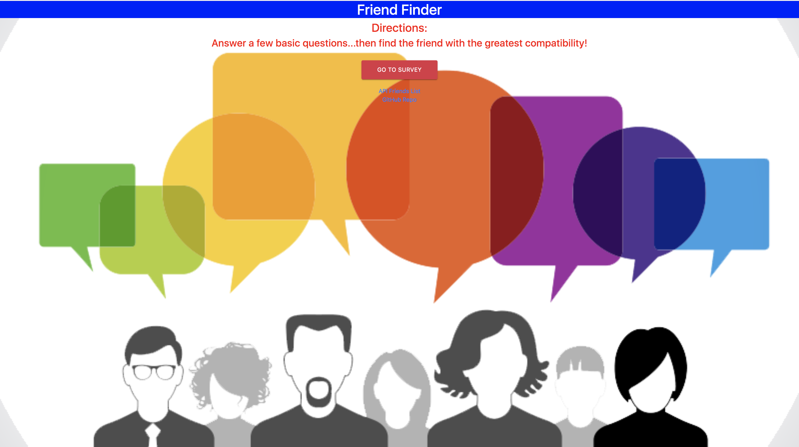

# Assignment: Friend Finder



## Summary:
Friend Finder is an application I created that  implements friend-matching logically based on the user/admin's responses to a random ten question survey. The user/admin would be able to answer the 10 questions by choosing answers choices ranging from 1--Strongly Disagree, to 5--Strongly Agree. When the survey is finished and submitted, the application will compare their answer values to an already-existing index scoring that would match closest to the user/admin's responding values within the survey. The closest set of user responses is defined as the set with the lowest absolute difference for all ten questions combined.

The Friend Finder application is meant to simulate a simple dating app of matching users with similar key element values. Friend Finder mainly is implemented by use of Node.js and Express JS within the back-end of the application and the Materialize & BootStrap CSS technologies on the front-end of things.


## Getting Started:
(1) Clone friend_finder repository via https://github.com/duongsters/friend_finder
(2) Run command line Terminal (or via Gitbash) 'npm install' for required NPMS used within the application
(3) Run command line 'node server.js' to start up the application
(4) Once connected to http://localhost:8080/ from CLI, copy that exact link to URL
(5) Run 'ctrl + c' within the CLI to exit the application entirely

## Technologies Used:
- NPM: I used specifically the Path and Express throughout the entire assigment. Initially I was also instructed in using NPM Body-Parser as well--but that was removed last minute.
- Node.JS: Basically the engine that runs the NPM packages used as stated above.
- Javascript: Basically used within the main files to render the entire application
- Bootstrap: Used for the stylings of the HTML files
- Materialize CSS: Used for stylings of the Survey.html file

## Code Snippet:
```html
<body style="background-image: url('http://www.pngmart.com/files/5/Survey-Transparent-PNG.png');background-repeat: no-repeat;
background-size: 100%;">


<h1 style="text-align: center; background: blue; color: white">Friend Finder</h1>

<div class="mainContainer" style="text-align: center">
    <div class="row">
        <div class = "col-12 col-md-12">
            <div id="mainSection">
                <h2 style="color: red">Directions:</h2>
                <h3 style="color: red">Answer a few basic questions...then find the friend with the greatest compatibility!</h3>
                <br>
                <a href="/survey"><button type="submit" class="btn btn-danger" style="height: 50px; width: 200px">Go to Survey</button></a>
                <br>               
                </a>
            </div>
        </div>
    </div>
</div>
<footer style="text-align: center">
<a href="/api/friends">API Friends List</a>
<br>
<a href="https://github.com/duongsters">GitHub Repo</a>
</footer>
</body>
```

## Author Links:
[GitHub](https://github.com/duongsters)
[LinkIn](https://www.linkedin.com/in/theandrewduong/)